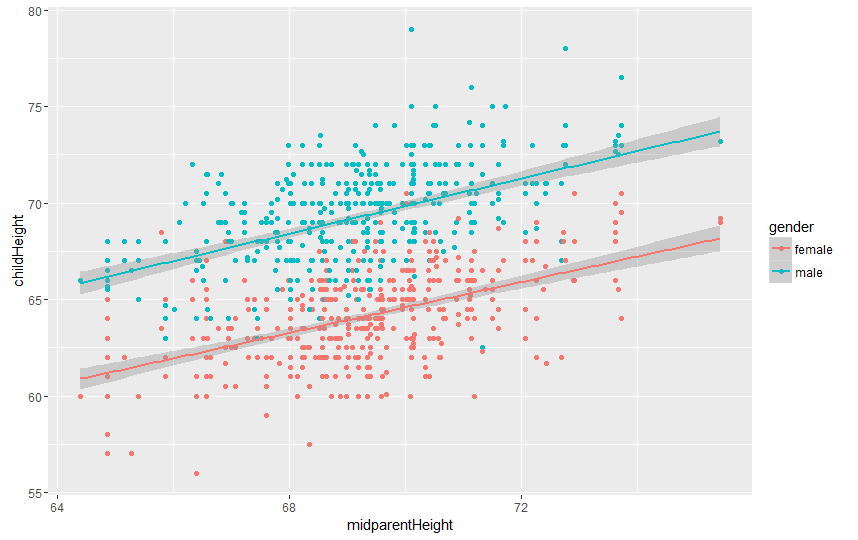

## <span style="color:blue">The Child's Adult Height Predictor App</span>

### <span style="color:green">If you're interested in predicting your child's adult height, this is a tool you'll want to try:</span> 

1. Open up the Child's Adult Height Predictor app [here](https://pell.shinyapps.io/Dev_data_products_final_project/)

2. Input Mother's height using the slidebar.

3. Input Father's height using the slidebar.

4. Input the child gender.

5. The App will automatically update and will display the estimated adult height of the child on the top right box.

---

## <span style="color:blue">Predictor Function Info</span>

* The GaltonFamilies dataset was used to build a linear regression model for the Child's Adult Height predictor.

* The Galton dataset is a dataset that was used by Galton in 1885 to study the correlation between the parent's height and their children.

* The Galton dataset contains data from 934 adult children born to 205 fathers and mothers.

* Galton generated a variable called the mid-parent height, calculated as (father + 1.08mother)/2 and used it as the predictor for the child stature.

Here below is a reference for the Galton study:

<span style="font-size:0.63em">Stigler, S. M. (1999). Statistics on the Table: The History of Statistical Concepts and Methods. Harvard University Press. Galton, F. (1886). Regression towards mediocrity in hereditary stature. Journal of the Anthropological Institute of Great Britain and Ireland, 15:246-263. Galton, F. (1869). Hereditary Genius: An Inquiry into its Laws and Consequences. London: Macmillan.</span> 

---
## <span style="color:blue">Linear Regression</span>

In this app the child's adult height linear regression model from the Galton dataset uses the child height as the outcome and the mid-parent height and the child gender as predictors. The regression model is shown below:


```{r, message=FALSE, comment=FALSE,warning=FALSE}

fit <- lm(childHeight ~ midparentHeight + gender,data=GaltonFamilies)
```
 </img> 


---
## <span style="color:blue">Child's Adult Height Model</span>




